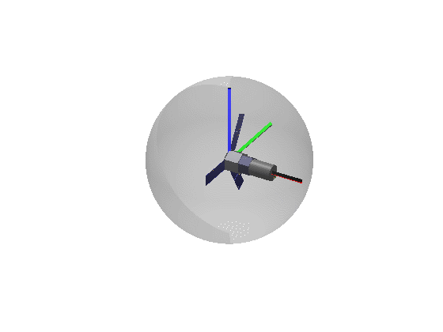

## Example of rigid body rotations in Javascript

This example uses the [three.js](https://github.com/mrdoob/three.js) library, which provides an easy and lightweight 3D visualization library. 

In order to visualize the orientation of an IMU(rigid body) with respect to the vehicle we would want to accomplish the following:

1. Define the reference frame of the vehicle and IMU
2. Draw a cube that represents our rigid body and is attached to IMU reference frame
3. Rotate the IMU given a rotation matrix, or create a rotation matrix
4. Apply the rotation the IMU 
5. Render

There is an example in both Matlab and Javascript. 

## Viewing the animation

Matlab - Run `draw_cad.m`
Javascript - Open `index.hmtl` with Chrome
